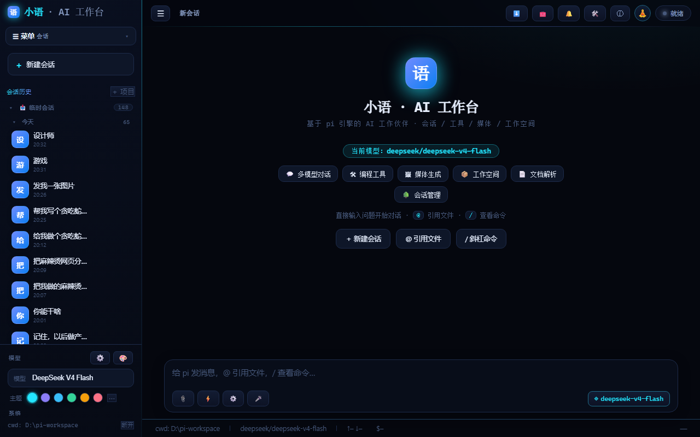
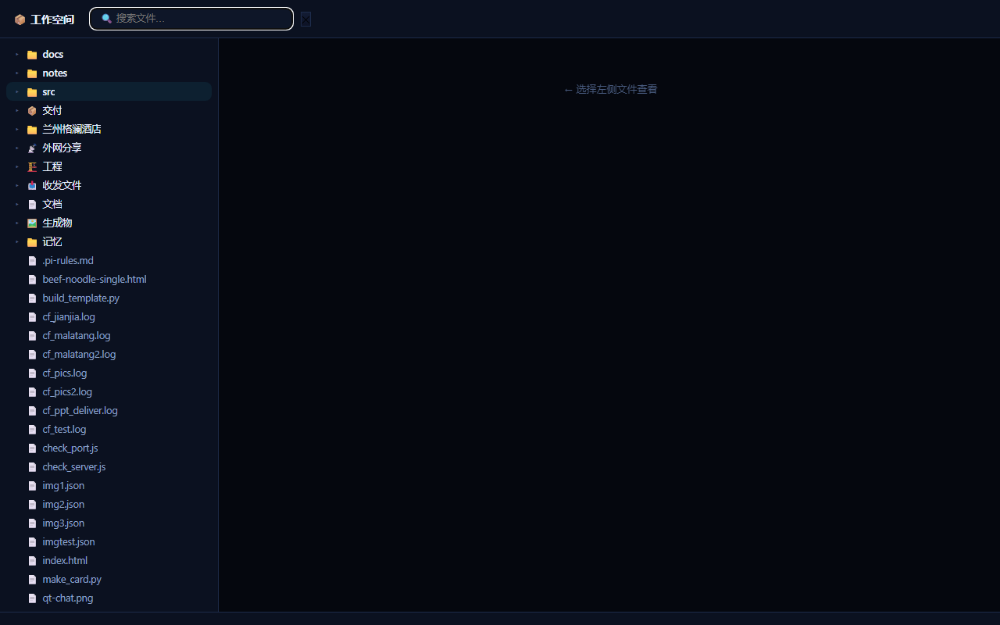

<p align="center">
  
</p>

# 小语 · AI 工作台（pi-web）

<p align="center">
  <b>一个有记忆、有情绪、会进化的 AI 工作伙伴</b>
</p>

<p align="center">
  
  
  
  
  
</p>

> 🧠 **记忆系统** · ❤️ **情绪引擎** · 🧬 **进化系统** · 📦 **智能文件交付** · 📡 **一键外网分享**

基于 [pi 引擎](https://github.com/earendil-works/pi-coding-agent) 的 Web 工作台——把终端里的 AI agent 变成完整的浏览器工作伙伴：会话、工具调用、媒体生成、工作空间管理，前后端一体，纯原生实现零构建。

## 🚀 一条命令安装（Windows）

**全局安装（推荐，对标 dsh，装完即用）：**

```powershell
npm i -g git+https://gitee.com/linxinyu520xue/pi-web.git
pi-web
```

首次运行 `pi-web` 自动完成：安装 **pi + dsh 双引擎** → 生成令牌 → 模型清单 → 启动服务并打开浏览器。

### 🔑 最后一步：配置 API 密钥（必做）

装完打开界面若模型不可用，是因为还没填密钥。三步搞定：

1. **获取密钥**：打开 https://platform.deepseek.com → API Keys → 创建，复制 `sk-` 开头密钥
2. **创建 `~/.pi/agent/auth.json`**（记事本新建），内容：

   ```json
   { "deepseek": { "type": "api_key", "key": "sk-你的密钥" } }
   ```

3. **重启服务**：`taskkill /F /IM node.exe` 后重新 `pi-web`（或 `cd ~/pi-web && node server.mjs`），刷新 http://127.0.0.1:8787 即可对话

> 默认模型 deepseek-v4-flash 官方直连兑底，只填 deepseek 一个 key 就能用；
> 更多模型商（小米/阿里/火山等）逐个加进 auth.json 即可，模型清单见 `~/.pi/agent/models-store.json`。
>
> **dsh 引擎的 key**：不写 auth.json，首次启动 `dsh web` 会弹窗引导填写（存为 `DEEPSEEK_API_KEY`），与 pi 共用同一把 DeepSeek key 即可。

> **备选（无 git 环境时用脚本安装，同样装双引擎）：**
> ```powershell
> # Gitee（国内快）
> irm https://gitee.com/linxinyu520xue/pi-web/raw/main/install-all.ps1 | iex
> # GitHub
> irm https://raw.githubusercontent.com/xueshao1716/pi-web/main/install-all.ps1 | iex
> ```
>
> **不想装 C 盘？** 安装时脚本会询问安装目录，回车=默认用户目录，输入 `D:\pi-web` 之类即可装到其他盘；
> 也可本地执行 `powershell -ExecutionPolicy Bypass -File install-all.ps1 -InstallDir D:\pi-web` 直接指定。
> 接着还会问 **pi/dsh 引擎全局包装到哪个盘**，输入 `D:\npm-global` 可将引擎也装到 D 盘（回车则保持 C 盘默认）。

## ✨ 为什么与众不同

| 能力 | 说明 |
|---|---|
| 🧠 **记忆系统** | 固定记忆 + 记忆日志自动沉淀 + 经验库，跨会话长期记得你的偏好 |
| ❤️ **情绪引擎** | VAD 三维情绪感知，对话自适应语气与节奏（烦躁时先安抚、着急时给快路径） |
| 🧬 **进化系统** | 任务完成自动归纳经验，越用越懂你的习惯 |
| 📦 **智能文件交付** | 要图只给图/要PPT只给PPT，关键词匹配 + 去重 + 断点续传 |
| 📡 **一键外网分享** | 项目放分享目录即上线，稳定域名，多项目零配置 |
| 🔍 **文件搜索工具** | search_files 按关键词/类型精准定位工作空间文件 |
| 🎨 **工作空间分类视图** | 工程/文档/生成物/交付分类 + 全屏浏览 + 树状连接线 |
| 🖼 **媒体生成** | 配图/配音/视频自动归档，钉钉式文件卡片展示 |
| 🌳 **会话管理** | 分支、模板、项目分组、导出、置顶 |
| 🎨 **万象人物工坊** | 专业写真工坊：场景/五要素/深度模式（人体分形+光影雕刻+去AI化材质）/色彩方案（三色法/极致/东方色） |
| 🖼 **图生图** | 上传真实照片拉入场景/图片修改，自动翻译英文提升控制力，落盘本地签名URL稳定展示 |
| 🖨 **批量出图** | 一次多张并行生成，网格展示点击选图，保存到本地，自动存档工作空间 |
| 🔌 **多出图通道** | minimax / 千问万相 / 火山 seedream / ModelScope / Agnes / Cloudflare FLUX.2 全家桶 |
| ⚡ **SSE 背压控制** | 对标 pi EventStream：慢网络不丢事件不堆内存，公网长回复稳定 |

> 📸 截图（真实界面）：

<p align="center">
  
  <br>
  <em>工作台主界面</em>
</p>

<p align="center">
  
  <br>
  <em>工作空间全屏浏览</em>
</p>

## 🚀 新机器一键安装（Windows）

复制下面**一整条命令**到 PowerShell 运行，自动完成：装 Node → 下载源码 → 装后端 pi 引擎 → 生成令牌 → 启动服务：

```powershell
powershell -ExecutionPolicy Bypass -Command "curl.exe -L -o %TEMP%\pi-web-install.ps1 https://raw.githubusercontent.com/xueshao1716/pi-web/main/install.ps1 && powershell -ExecutionPolicy Bypass -File %TEMP%\pi-web-install.ps1"
```

**国内用户（Gitee 镜像，更快）：**

```powershell
powershell -ExecutionPolicy Bypass -Command "curl.exe -L -o %TEMP%\pi-web-install.ps1 https://gitee.com/linxinyu520xue/pi-web/raw/main/install.ps1 && powershell -ExecutionPolicy Bypass -File %TEMP%\pi-web-install.ps1"
```

**或手动 clone（已装 git 时）：**

```bash
# Gitee（国内快）
git clone https://gitee.com/linxinyu520xue/pi-web.git
# 或 GitHub
git clone https://github.com/xueshao1716/pi-web.git
cd pi-web
node setup.mjs --install
```

装完后：
1. 浏览器打开 `http://127.0.0.1:8787`
2. 输入访问令牌（查看 `C:\Users\你的用户名\pi-web\.token`）
3. 配置 API 密钥（编辑 `~/.pi/agent/auth.json`，如 deepseek）

> 国内网络自动切换 ghproxy 镜像下载，无需手动处理。

## 🧩 内置技能（开箱即用）

| 技能 | 用途 |
|---|---|
| `web-search` | 网页搜索（Brave API，可选 key） |
| `image-generation` | 图片生成（配图/画图） |
| `voice-transcribe` | 语音转文字（录音/会议） |
| `session-export-redacted` | 导出会话自动脱敏 |
| `wanxiang-portrait` | AI 人物写真提示词（MJ/SD/即梦/Imagen3 通用） |
| `wanxiang-design` | 平面设计提示词（三维坐标/东方美学/色彩引擎） |
| `novel-forge-v10` | AI 中文网文写作（产品化/5层共进化/编辑部8角色/灵魂系统/元认知） |

技能面板（左侧 ⚡）直接可用，无需额外安装。

> 🎨 **独立技能仓库**：[wanxiang-portrait-skill](https://github.com/xueshao1716/wanxiang-portrait-skill) —— AI 人物写真提示词生成技能（含 37 章完整系统文档），可单独 clone 到任意技能目录使用。

> 📋 完整技能清单（含 78 个用户技能）见 [SKILLS.md](SKILLS.md)

## 🤖 支持模型

| Provider | 模型 | 说明 |
|---|---|---|
| deepseek | `deepseek-v4-flash` / `deepseek-v4-pro` | 默认，推理强 |
| 小米 mimo | `mimo-v2.5` / `mimo-v2.5-pro` / `mimo-v2-pro` | 中文好，v2.5 支持图片 |
| Agnes | `agnes-2.5-pro` / `agnes-2.5-flash` 等 | 多用途 |
| 阿里云百炼 | `wan2.7-image` 等 | 图像生成 |
| **ModelScope** | `Tongyi-MAI/Z-Image-Turbo` | **免费**每天 2000 次文生图 |
| **Cloudflare** | `FLUX.2 Dev/Klein` / `Leonardo` 等 | **免费**每天 10k Neurons，FLUX.2 高质量 |
| **NVIDIA** | `DiffusionGemma 26B` | 免费聊天+图文 |
| openrouter | 全模型（Claude/GPT/Gemini/Kimi 等） | 需 openrouter key |
| openai | `gpt-4.1` / `gpt-5` 系列 | 需 openai key |
| 火山方舟 | `volces-ark` 系列 | 需 ark key |

> 完整模型清单见 `models.example.json`，复制到 `~/.pi/agent/models-store.json` 即可。

## 特性

- 💬 多模型对话（deepseek / 小米 mimo 等）+ 思考 + 工具调用
- 🛠 编程工具：读文件 / 写文件 / 编辑 / 跑命令
- 🖼 媒体生成：配图、配音（自动归档到工作空间）
- 📡 外网分享：项目放入分享目录，一键生成公网链接
- 📦 工作空间：工程 / 生成物 / 文档 / 交付 四区管理，一键交付
- 📄 文档：Markdown / PDF / Office 解析
- 🌳 会话：分支、模板、项目分组、导出
- 🎨 主题编辑器、可视化页面设计器、技能面板

## 环境要求

- Node.js ≥ 20
- pi 引擎全局安装：`npm i -g @earendil-works/pi-coding-agent`

## 快速开始

```bash
# 方式零：Windows 一键安装（推荐给小白用户，自动装 Node + 下载 + 启动）
powershell -ExecutionPolicy Bypass -File install.ps1

# 方式一：一键安装向导（推荐，跨平台）
node setup.mjs            # 检测环境并引导
node setup.mjs --install  # 自动安装缺失依赖
node setup.mjs --start    # 启动服务

# 方式二：手动
# 1. 安装依赖（pi 引擎）
npm i -g @earendil-works/pi-coding-agent
# 2. 配置 API 密钥
#    编辑 ~/.pi/agent/auth.json（见下文“配置模型与密钥”）
# 3. 启动
node server.mjs
# 或 Windows：start.bat

# 3. 访问
# http://127.0.0.1:8787
# 首次打开输入访问令牌（见 .token 文件或环境变量 PI_WEB_TOKEN）
```

## 环境变量

| 变量 | 默认值 | 说明 |
|---|---|---|
| `PI_WEB_PORT` | `8787` | 服务端口 |
| `PI_WEB_HOST` | `127.0.0.1` | 监听地址 |
| `PI_WEB_TOKEN` | 自动生成 | 访问令牌（存 `.token`） |
| `PI_WEB_CWD` | `~/pi-workspace` | 工作空间根目录 |
| `PI_WEB_TOOLS` | `read,write,edit,bash` | 允许的工具集 |
| `PI_WEB_MODEL` | 第一个可用 | 默认模型 |
| `PI_PACKAGE` | 自动解析 | pi 引擎入口路径 |
| `PI_WEB_SHARE_HOST` | 空 | 外网分享域名（可选，配置后启用分享） |

## 配置模型与密钥

### 两个文件，分工明确

| 文件 | 位置 | 内容 | 是否入库 |
|---|---|---|---|
| `models-store.json` | `~/.pi/agent/` | 模型清单（ID、接口、地址、计费） | ❌ 本地私有（仓库提供 `models.example.json` 模板） |
| `auth.json` | `~/.pi/agent/` | 各 provider 的 API 密钥 | ❌ 绝不入库 |

### 模型清单（models-store.json）

仓库提供了精简模板 [`models.example.json`](models.example.json)，包含 6 个 provider 的代表模型：

```bash
cp models.example.json ~/.pi/agent/models-store.json
```

每个模型的字段：

```json
{
  "id": "deepseek-v4-flash",      // 模型 ID（请求时使用）
  "name": "DeepSeek V4 Flash",    // 显示名
  "api": "openai-completions",     // 接口协议：openai-completions / openai-responses
  "provider": "deepseek",          // 提供方名（与 auth.json 的 key 对应）
  "baseUrl": "https://api.deepseek.com",  // API 地址
  "reasoning": true,               // 是否推理模型
  "input": ["text"],               // 支持的输入：text / image
  "cost": { "input": 0.3 },        // 计费（可选）
  "contextWindow": 1000000,        // 上下文窗口
  "maxTokens": 384000              // 最大输出
}
```

### API 密钥（auth.json）

模型文件本身**不含密钥**。密钥按 provider 名放在 `~/.pi/agent/auth.json`：

```json
{
  "deepseek": { "type": "api_key", "key": "sk-xxx", "baseUrl": "https://api.deepseek.com" },
    "openrouter": { "type": "api_key", "key": "sk-or-xxx", "baseUrl": "https://openrouter.ai/api/v1" }
}
```

- `provider` 字段（models-store.json）与 auth.json 的**顶层 key 必须同名**，服务才能找到对应密钥
- 会话记录同样在 `~/.pi/agent/sessions/`（仓库外，不提交）

### 添加新 provider 三步

1. `models-store.json` 加一个 provider 节点（照模板抄）
2. `auth.json` 加同名 key + API 密钥
3. 重启服务，底部模型选择器即可看到

## 外网分享（可选）

1. 将项目放入工作空间的 `外网分享/` 目录（或自定目录）
2. 配置 `PI_WEB_SHARE_HOST` 指向你的域名，并按需配置隧道（如 cloudflared）
3. 分享链接：`https://<你的域名>/<项目名>/`

## 开发

- 前端：`public/`（原生 HTML/CSS/JS，无构建步骤）
- 后端：`server.mjs`（Node 原生 http）
- 版本管理：见 `CHANGELOG.md`，每次迭代递增版本号并同步 `SYS_VERSION`（`public/js/workspace.js`）

## 开源约定

- 私有信息（域名、令牌、密钥、内网地址）**绝不写入**代码与文档
- 路径不硬编码：一律环境变量 + 跨平台推导（`os.homedir()` / `process.cwd()`）
- 平台差异：Node 标准 API 优先，避免 Windows 特有命令

## License

MIT
